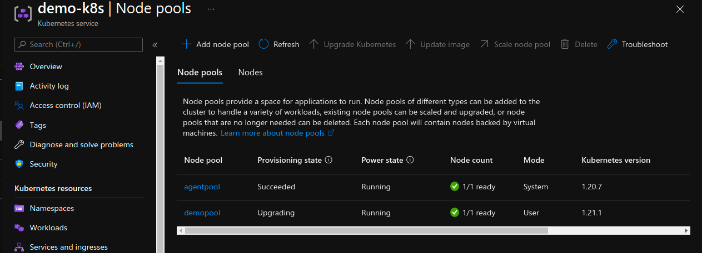
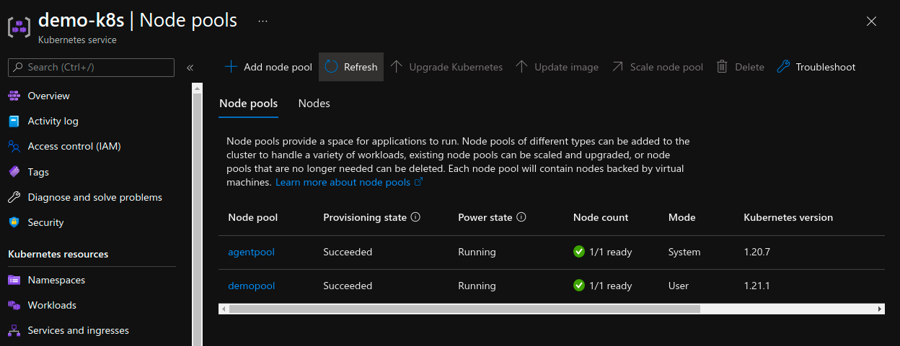

Simple script to upgrade AKS Node Pools.

#### **\# before**

Node Pools Kubernetes version can't be higher that Control Plane Kubernetes version.

```
$ kubectl version

$ kubectl get nodes
NAME                                STATUS   ROLES   AGE   VERSION
aks-agentpool-21878470-vmss000000   Ready    agent   44m   v1.20.7
aks-demopool-21878470-vmss000000    Ready    agent   43m   v1.20.7

> Azure related
export ARM_CLIENT_ID=<> ;\
export ARM_CLIENT_SECRET=<> ;\
export ARM_TENANT_ID=<> ;\
export ARM_SUBSCRIPTION_ID=<>

> K8s related
export RESOURCE_GROUP_NAME=<> ;\
export CLUSTER_NAME=<> ;\
export KUBERNETES_NODE_VERSION=<>

> more details (help)
$ ./npupgrade.sh
```

#### **\# upgrade**

```
$ az aks list --output table

$ az aks nodepool list --cluster-name $CLUSTER_NAME --resource-group $RESOURCE_GROUP_NAME --output table
Name       OsType    VmSize        Count    MaxPods    ProvisioningState    Mode
---------  --------  ------------  -------  ---------  -------------------  ------
agentpool  Linux     Standard_B2s  1        110        Succeeded            System
demopool   Linux     Standard_B2s  1        110        Succeeded            User

$ kubectl get nodes
NAME                                STATUS   ROLES   AGE   VERSION
aks-agentpool-21878470-vmss000000   Ready    agent   44m   v1.20.7
aks-demopool-21878470-vmss000000    Ready    agent   43m   v1.20.7

$ ./npupgrade.sh upgrade demopool
(...)

$ ./npupgrade.sh status demopool
--- Checking status.. ---
Cluster Provisioning State is Succeeded
Node Pool Provisioning State is Upgrading
```


```
$ ./npupgrade.sh status demopool
--- Checking status.. ---
Cluster Provisioning State is Succeeded
Node Pool Provisioning State is Succeeded

$ kubectl get nodes
NAME                                STATUS   ROLES   AGE     VERSION
aks-agentpool-21878470-vmss000000   Ready    agent   81m     v1.20.7
aks-demopool-21878470-vmss000000    Ready    agent   4m46s   v1.21.1
```

